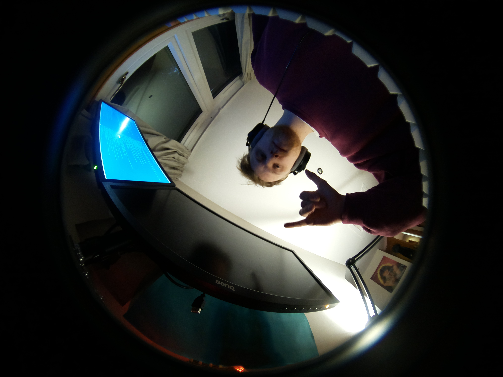

### 18.12.2020
--------------
Spent the whole day plugging and replugging these wretched FFC cables to get
each of the pi zeros to see their cameras. Seems like there is no knack to 
plugging these things in and that you just have to try 340832 times and hope
for the best. 

got all four to be recognied by their pis and now I never intend to unplug 
them again. 

Took five very blurry images and had a twist at all the twisty bits on the
camera/lens. No twist was successfull. Will have to twist more once I can 
stream the image.

Here's a couple of examples for you to feast your eyes on. 

### 22.12.2020
--------------

Made the git repository. Enough work for a day. 

### 23.12.2020
--------------
Decided to use a magic video networking python library (VidGear). Looks like
it makes streaming video over the network really easy. Also has a "PiGear" 
class for using the raspi camera. 

Got things started then with a client and server.

python is the best.

### 24.12.2020
--------------
Refactor man showed up again today and just started blasting. Ripped all the
video preview code out and stuck it in it's own class. Seperated out the 
client server and made a controller script and camera module script to run as
deamons on the controller pi and each of the pi zeros. . 

Tidied everything up too.

Cheers to refactor man. 

### 25.12.2020
--------------

It's Christmas. Spent day trying to get the server and client to connect. 
Ripping hair out. Can't see why it's not connecting. Must be some network
shennanigins. :'(

### 26.12.2020
--------------

Realised that I'm a moron and that the reasong the client/server have
been unable to connect is because i've been spelling the word "address"
wrong. 26 years of exsistence and i've just discovered it has two fucking
d's in it. It even looks wrong with one d. Adress. look at it. Disgusting. 

Anyways, now that I've passed the named parameter **"address"** to netGear 
it just works. Boxing day miracle. 

### 28.12.2020
--------------

Fuck yes, got the first images streaming back from the p1 server. The fish eye
lens is the coolest fucking thing I've ever seen. I cannot wait to make it wiggle.

Took a couple of snaps now that I have one of the lenses focused. 

